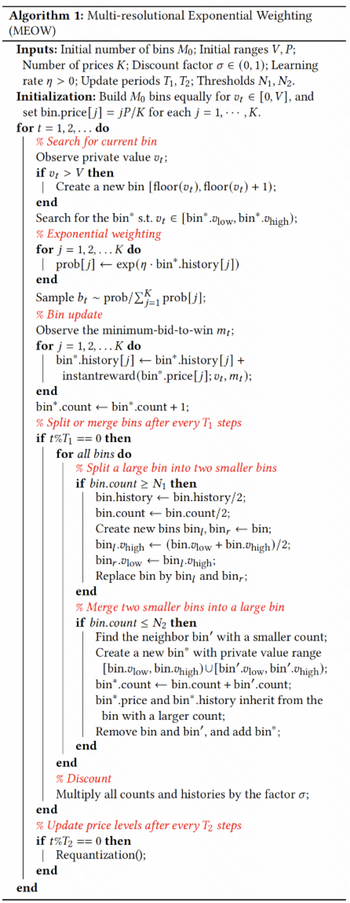
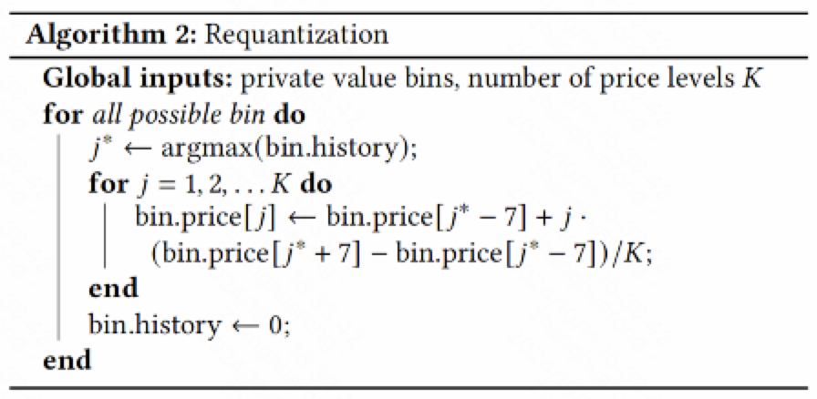
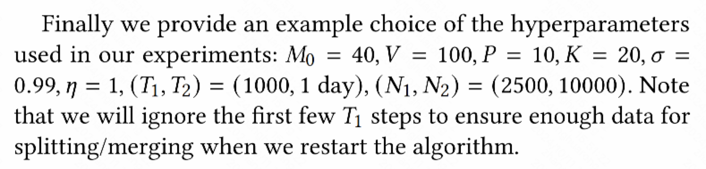

# bid_shading_meow
## 前言
业务接触到了bid shading 的需求，发现MEOW这篇的做法很有趣，输入只有v，
即 *Tcpa * Ctr * Cvr * 1000 * α*，
且我们业务数据的分布与其相似（存在尖刺情况），故对其进行了复现，并在我们
的数据上进行了本地测试以及线上ABTest。
## 算法

  

图1 主体算法流程

  

图2 更新桶算法流程

  

图3 参考超参数

## 体验
⚡️exponential_weighting函数，即prob[j]的赋值，在本地数据的后续计算中会出现爆掉的情况，
改为了过softmax再进行最终的出价选择。

⚡️原instantreward函数，在本地数据的测试中，对高价广告的shading程度过高，对业务的拉端影响
很大，故做了挺多改版，但业务tcpa、adset的调整比较多，模型并不稳定、不好调控（也是后续换成多特征预测最
小竞的价格模型的原因之一）。

    def instantreward(self, b, v, m):
        if b > m:
            return v-b
        else:
            return 0
️⚡️论文给出的N1、 N2数值大小关系似乎不太对，分桶合桶很奇怪，个人倾向于（N1, N2) = (10000, 2500)。

论文地址：https://dl.acm.org/doi/abs/10.1145/3447548.3467113